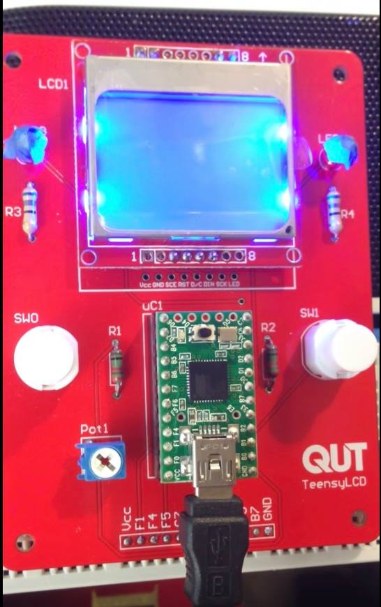
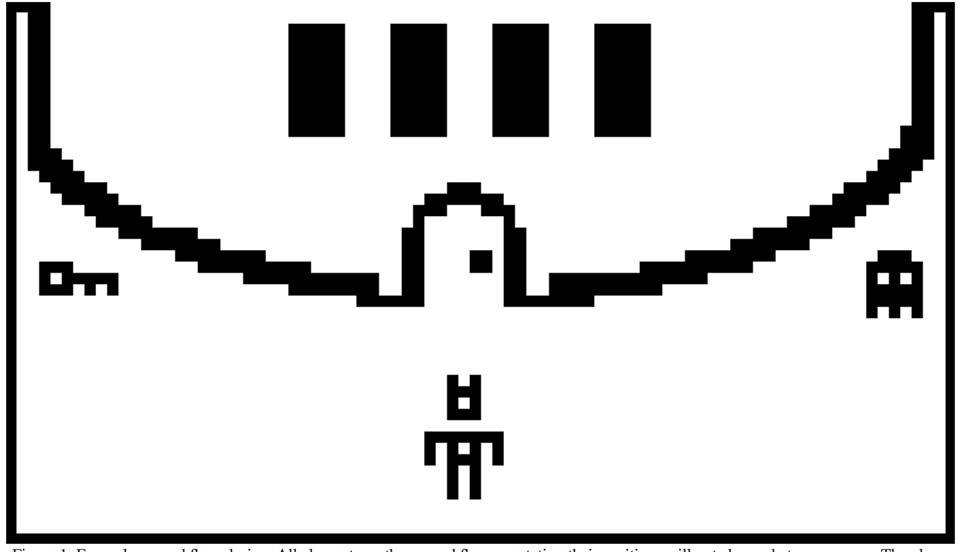

So as a part of my CS minor micro-controller module we have to make a Zelda-like game, which is seeming quite challenging!

This thing only has 32KB RAM which is less than a Commodore 64 so you can not even do While loops without a crash.

 

