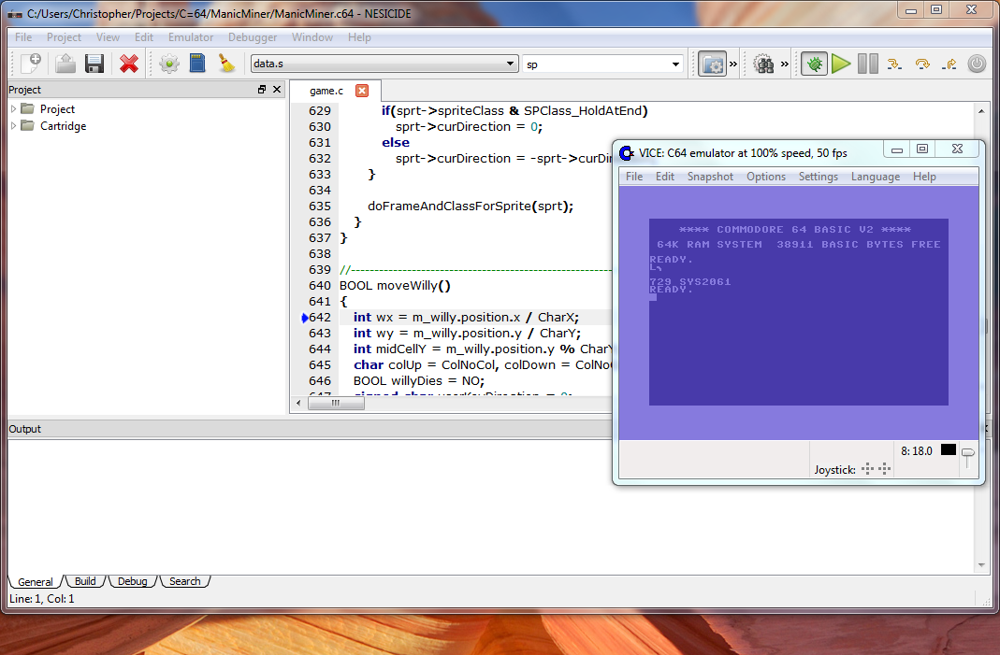

So – micro-controllers – working on registers, dealing with low ram, debouncing. I've been seeing a lot of crossover between classic gaming systems and micro-controllers.

I'm currently trying to port a game I've made using the CC65 cross-compiler.

Since both use C and are very low-level this shouldn't be too difficult!

[http://www.cc65.org](http://www.cc65.org)

  

